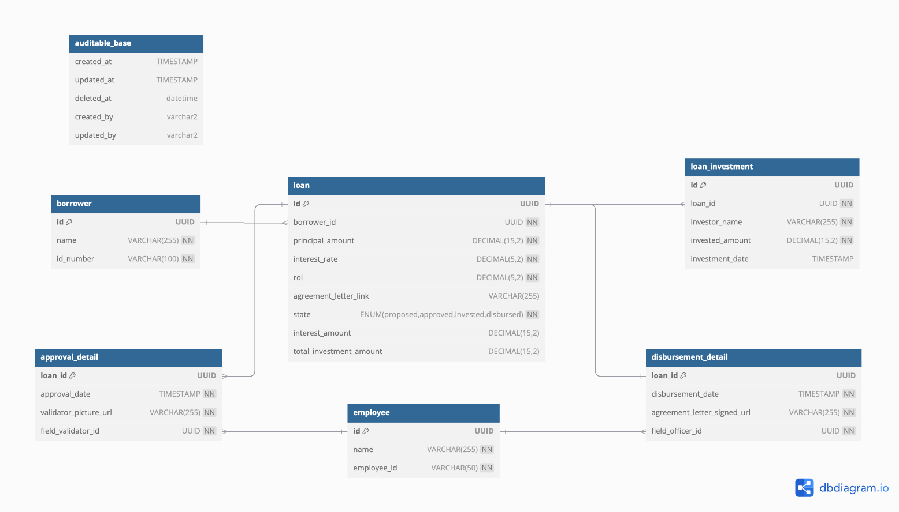

# Loan Management System

An example of loan management system


# Tables
- borrower: Stores borrower information.
- employee: Stores employee information.
- loan: Contains loan details and the current state of the loan.
- approval_detail: Captures approval-related details for loans.
- loan_investment: Records investments made into loans.
- disbursement_detail: Details related to loan disbursement.




# How to Run
```
docker-compose up -d
```